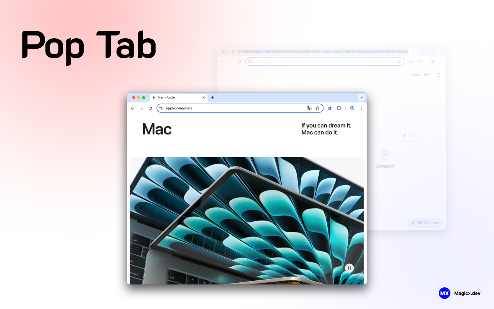

# PopTab 浏览器扩展

 

本项目是一个基于 WXT 和 Vue 3 构建的浏览器扩展。其核心功能是一键将当前标签页弹出到新窗口，并支持中英文多语言切换。

 

<a href="./README.md">🇬🇧English</a> | <a href="./README.zh-CN.md">🇨🇳简体中文</a>

## 主要特性

- 🚀 **弹出标签页**：一键快速将当前标签页移动到新窗口
- 🕵️ **匿名窗口支持**：可选择在匿名窗口中打开当前标签页
- 🌐 **多语言本地化**：内置中英文切换，支持国际化
- ⚡ **热重载开发**：基于 WXT 的高效开发工作流
- 🧩 **Manifest V3 支持**：兼容最新浏览器扩展标准
- 🛡️ **安全与权限**：遵循最小权限原则，保障用户安全

## 许可证

MIT
